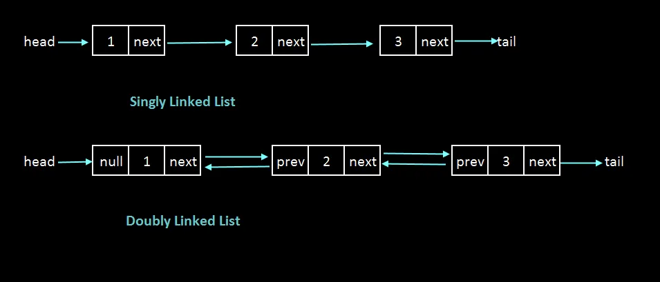

# Темы для подготовки на собеседование на должность фронтенд-разработчика

Содержание:
- [Математика](#математика)  
(пределы, матрицы, простые операции с ними, теория вероятностей)
- [Информатика](#информатика)  
(переводы в системы счисления)
- [Структуры данных](#структуры-данных)  
(определение, принципы работы, применение)
- [Веб](#веб)  
(как работает интернет, протоколы TCP/IP, IP-маршрутизация, DNS, HTML, HTTP/HTTPS, отличия и применение; запросы GET/POST/PUT/DELETE)
- [ООП](#ооп)  
(инкапсуляция, наследование, полиморфизм)
- [Базы данных](#базы-данных)  
(виды, простейшие sql-запросы)
- [Информационная безопасность](#информационная-безопасность)  
(Шифрование, кодирование, хэширование)

## Математика
### Элементы мат.логики
---
**Конъюнкция A ∧ B** - лог. "И"  
**Дизъюнкция A ∨ B** - лог. "ИЛИ"  
**Эквиваленция A ⇔ B**: `true`, если `A = B`  
**Импликация A ⇒ B**: `false`, если `A = true`, `B = false`  
*Реализация импликации в JS:*  
```javascript
!A || B
```  

**Предикат** - суждение, зависящее от переменной. Например: `A(x) = x+2 > 0` - предикат.  
**Квантюры**:  
**∀** – *квантор всеобщности*  
Пример: `∀x: A(x) = true`, если `A(x) = true` для всех `x`.  

**∃** – *квантор существования*  
Пример: `∃x: A(x) = true`, если `A(x) = true` хотя бы для одного `x`. 

### Множества
---
A = {*x* ∈ B | C(*x*)} - множество, состоящее из элементов множества B, обладающими свойством C(x)

X **U** Y - объединение множеств X и Y (все элементы).  
X **⋂** Y - пересечение множеств X и Y (общие элементы).  

X **⊆** Y - X подмножество Y.  
X **⊂** Y - X подмножество Y, но X != Y (строгое подмножество).  

**U** или **Е** - **унивесальное множество**, если каждое данное множество является его подмножеством.  
**Дополнение множества** - это множество недостающих элементов из универсального множества. 

**∅** - пустое множество.  

**Прямым (декартовым) произведением** множеств X и Y называется множество всевозможных упорядоченных пар (x,y).  
Пример: Если X = {1,2,3}, а Y = {5,7}, то X×Y = {(1,5),(1,7),(2,5),(2,7),(3,5),(3,7)}.  

### Некоторые числовые множества:
**ℕ** – множество всех натуральных чисел (1; 2; 3; 4; ...);  
- ℕ0 - с нулём;  
- ℕ1 - без нуля;  

**ℤ** – множество всех целых чисел;  
**ℚ** - множество всех рациональных чисел (-2.56; -5/18; 0; 0.5; 1; 12/7);  
**ℂ** - множество комплексных чисел (a + bi);  
**ℝ** = (−∞, +∞) – множество всех вещественных чисел (числовая прямая);  
**[a,b]** – сегмент (отрезок), т. е. множество всех вещественных чисел `x`, удовлетворяющих неравенству `a <= x <= b`;  
**(a,b)** – интервал, т. е. множество всех вещественных чисел `x`, удовлетворяющих неравенствам `a < x < b`;  
**[a,b), (a,b]** – полуинтервал (полусегмент), т. е. множество всех вещественных чисел `x`, удовлетворяющих соответственно неравенствам `a <= x < b; a < x <= b`;  
**(−∞,a), (a,+∞)** – бесконечные интервалы;  
**(−∞,a], [a,+∞)** – лучи.  

### Предел числовой последовательности
**Предел числовой последовательности** - это число, к которому все члены последовательности приближаются, когда номер члена последовательности становится очень большим. Если предел существует, то говорят, что последовательность сходится к этому пределу.  

Чтобы доказать, что предел последовательности равен определенному числу *L*, вам необходимо строго доказать, что для любого *E* > 0 существует соответствующее натуральное число *N*, начиная с которого все члены последовательности находятся в пределах *E* от *L*.  

Последовательность называется **бесконечно малой**, если предел последовательности при `n -> ∞` равен **0**.  
Последовательность называется **бесконечно большой**, если предел последовательности при `n -> ∞` равен **∞**.  

### Предел функции
---
**Предел функции** - это значение, к которому стремится функция, когда её аргумент приближается к определённому числу. Другими словами, предел функции говорит о том, что происходит с значением функции, когда её аргумент приближается к определённой точке на графике.  

Чтобы **вычислить** предел, иногда можно просто подставить значение, к которому стремится переменная, и вычислить значение функции. Например, `lim x->3 (2x + 1) = 2*3 + 1 = 7`.  
В **сложных ситуациях**, когда нельзя просто подставить значение переменной, существует несколько методов для вычисления пределов функций, например:  
- *Факторизация*: Если функция содержит выражение, которое можно факторизовать или упростить, это может помочь в вычислении предела. Например, `lim x->2 (x^2 - 4) / (x - 2)`. Здесь можно преобразовать числитель к виду `(x - 2)(x + 2)`, и затем сократить `(x - 2)` в числителе и знаменателе, что даст `lim x->2 (x + 2) = 2 + 2 = 4`.  
- *Теорема о пределе композиции функций*: если мы хотим найти предел функции `f(g(x))` при *x*, стремящемся к какому-то числу *c*, мы можем сначала найти предел `g(x)` при *x*, стремящемся к *c*, и затем подставить этот предел вместо `g(x)` в функцию `f(x)` и найти предел этой новой функции.  
Например, если мы хотим найти предел `lim x->0 (sin(x^2))`, мы можем сначала найти предел `lim x->0 (x^2)`, что равно `0^2 = 0`, и затем подставить этот результат в функцию `sin(x)`, получив `sin(0)`, что равно `0`.  

### Матрицы
---
**Матрица** представляет собой упорядоченный набор чисел, расположенных в виде прямоугольной таблицы, состоящей из строк и столбцов. Каждое число в матрице называется **элементом**.  
**Обозначение матрицы**: обычно матрицы обозначаются заглавными буквами, например, **А** или **В**,  а её элементы - маленькими буквами с индексами, например аij, где *i* - номер строки, а *j* - номер столбца.  

### Операции с матрицами
1. **Сложение**: Для сложения матриц они должны быть одинаковых размеров (то есть иметь одинаковое количество строк и столбцов). Сложение происходит покомпонентно, то есть каждый элемент результата равен сумме соответствующих элементов исходных матриц.  
Пример:  
  
2. **Умножение на скаляр**: Умножение каждого элемента матрицы на заданное число.  
Пример:  
  
3. **Умножение матриц**: Умножение матриц определено, когда количество столбцов первой матрицы равно количеству строк второй матрицы. Результатом умножения матриц будет новая матрица, в которой элемент на позиции (*i*, *j*) равен сумме произведений элементов i-й строки первой матрицы на элементы j-го столбца второй матрицы.  
Пример:  
    
4. **Транспонирование**: Транспонирование матрицы означает замену строк матрицы на соответствующие столбцы (и наоборот). Обозначается через A^T.  
Пример:  
  
5. **Определитель матрицы**: Определитель квадратной матрицы *A* размера *n* x *n* обозначается как det(*A*) и является числовой характеристикой этой матрицы. Он используется для решения систем линейных уравнений и определения обратной матрицы. (вычисляется по различным формулам в зависимости от размера и структуры)  
6. **Обратная матрица**: Квадратная матрица *A* имеет обратную, если ее определитель не равен нулю. Обратная матрица *A*^(-1) определяется так, что произведение *A* x *A*^(-1) равно единичной матрице (ед. матр. - квадратная матрица, у которой на главной диагонали стоят единицы, а остальные элементы равны нулю).  
Пример:  
  
7. **Деление матриц**: Умножение на обратную матрицу.  

### Теория Вероятностей  
---
#### Формулы и случаи
Теория вероятностей рассматривает случайные события в рамках бесконечности.  

Виды событий:  
- **Совместимые** — те, которые могут произойти одновременно.
- **Несовместимые** — те, которые исключают друг-друга. Например, при подбрасывании монетки может выпасть либо орёл, либо решка — оба одновременно они выпасть не могут.  

Вероятность события: `[Кол-во благоприятных событий] / [Общее число событий]`.   

**Сумма** событий **A + B**: Если случится событие A **ИЛИ** событие B.  
**Произведение** событий **A x B**: Если случится событие A **И** событие B.  

**Сумма совместимых событий**:  
Если нужно найти вероятность совместимых событий, то необходимо **найти сумму** этих событий и **вычесть** из неё **их произведение**: `A + B - A x B`.  
*Например*, нужно вычислить вероятность того, что выбранное из чисел от 1 до 10 будет *нечётным* ИЛИ *делиться на 7 без остатка*:  
1. Вероятность того, что число нечётное = 0.5;
2. Вероятность того, что число кратно 7 = 0.1;
3. A + B = 0.6;
4. A x B = 0.05;
5. A + B - A x B = 0.6 - 0.05 = 0.55.  

**Сумма несовместимых событий**:  
Если нужно найти вероятность суммы всех несовместимых событий, то необходимо **найти сумму** этих событий и **вычесть** из неё **пересечение** этих событий: `P[A U B] = P[A] + P[B] - P[A ⋂ B]`.  
*Например*, среди учеников школы 15% процентов знают *французский язык* и 20% знают *немецкий*. Доля тех, кто *владеет обоими языками* всего 5%. Необходимо найти долю учеников, знающих *хотя бы один* из этих двух языков:  
- 15% + 20% - 5% = 30%  

**Условная вероятность**:
Если нужно найти вероятность наступления **A при условии B**, нужно **пересечение** обоих вероятностей **разделить на вероятность условия B**: `P[A | B] = P[A ⋂ B] / P[B]`.  
*Например*, среди учеников школы 15% процентов знают *французский язык* и 20% знают *немецкий*. Доля тех, кто *владеет обоими языками* всего 5%. Необходимо среди знающих немецкий найти долю учеников, знающих и французский:  
- 0.05 / 0.20 = 0.25 = 25%  

**Пересечение вероятностей**:  
И обратно, чтобы найти вероятность того, что произойдут оба события A и B, надо умножить вероятность события B на условную вероятность события A при известном B, то есть: `P[A ⋂ B] = P[B] x P[A | B]`.  

---

#### Задачи и примеры  
**Задача 1.** В кармане лежит 6 монет: 2 рублёвых, 2 пятирублёвых и 2 десятирублёвых. Мы по очереди достаём 2 из них случайным образом. Найдите вероятность того, что они обе будут одного номинала.  
**Решение:**  
- Вероятность достать рублёвую монету: 2/6 = 1/3.  
- Вероятность снова достать рублёвую монету: 1/(6-1) = 1/5.  
- Вероятность достать две рублёвые монеты = 1/3 x 1/5 = 1/15.  
- Точно такая же вероятность будет для пятирублёвых и десятирублевых монет. Теперь найдем вероятность достать две монеты одного номинала.  
- 1/15 + 1/15 + 1/15 = 3/15 = 1/5 = 0.2

**Задача 2.** Вы бросаете 2 игральные кости с шестью сторонами. Найдите вероятность того, что сумма выпавших очков будет равна 7.  
**Решение:**  
- Общее число возможных результатов при бросании 2 костей равно 6 x 6 = 36.  
- Существует 6 комбинаций, дающих сумму 7.  
- Вероятность события равна 6 / 36 = 1/6.  

**Задача 3.** Бросаем два игральных кубика: красный и синий. Определите вероятность того, что цифры на красном и синем кубиках совпадут.  
**Решение:**  
- Всего существует 6 благоприятных исхода, что цифры совпадут.  
- Всего кобинаций того, упадут два кубика - 36.  
- Вероятность совпадения цифр: 6/36 = 1/6.  

**Задача 4.** В этом же эксперименте с кубиками нужно найти наиболее вероятную сумму цифр на кубиках.  
**Решение:**  
- Мы уже знаем, что всего возможно 36 различных комбинаций результатов бросков двух кубиков.  
- Посмотрим на то, какие суммы могут быть получены при броске двух кубиков:  
Сумма 2: (1, 1)  
Сумма 3: (1, 2), (2, 1)  
Сумма 4: (1, 3), (2, 2), (3, 1)  
Сумма 5: (1, 4), (2, 3), (3, 2), (4, 1)  
Сумма 6: (1, 5), (2, 4), (3, 3), (4, 2), (5, 1)  
Сумма 7: (1, 6), (2, 5), (3, 4), (4, 3), (5, 2), (6, 1)  
Сумма 8: (2, 6), (3, 5), (4, 4), (5, 3), (6, 2)  
Сумма 9: (3, 6), (4, 5), (5, 4), (6, 3)  
Сумма 10: (4, 6), (5, 5), (6, 4)  
Сумма 11: (5, 6), (6, 5)  
Сумма 12: (6, 6)  
- Как видно, наибольшее количество комбинаций (6) существует для суммы 7, значит вероятность выпадения этой суммы больше, чем любой другой (6/36 = 1/6).  

**Задача 5.** Известно, что ученики класса, имеющие двойки по алгебре, составляют 25%, а ученики, имеющие двойки по геометрии, составляют 15%. Сколько учеников имеют двойки и по алгебре, и по геометрии, если ученики, не имеющие двоек ни по одному из предметов, составляют 70%?   
**Решение:**  
- Доля учеников, имеющих двойки хотя бы по одному предмету: 100% - 70% = 30%.  
- Доля учеников, имеющих двойки по обоим предметам одновременно: `P[A ⋂ B] = P[A] + P[B] - P[A U B]`.  
- P[A ⋂ B] = 25% + 15% - 30% = 10%.  

**Задача 6.** В классе 50% мальчиков; среди мальчиков 60% любит мороженое. Какова доля мальчиков, любящих мороженое, среди учеников класса? Как это переформулировать на языке теории вероятностей?  
**Решение:**  
- Доля мальчиков, любящих мороженое: `P[A ⋂ B] = P[B] x P[A | B]`.  
- P[A ⋂ B] = 0.50 x 0.60 = 30%.  

## Информатика  

### Перевод из десятичной системы счисления в любую другую  
Чтобы перевести целое положительное десятичное число в систему счисления с другим основанием, нужно это **число разделить на основание**. Полученное частное **снова разделить на основание**, и дальше до тех пор, пока частное не окажется меньше основания. В результате записать в одну строку последнее частное и все остатки, начиная с последнего.  
Пример 1: Перевести десятичное число 46 в двоичную СС.  
  
Ответ: 101110.  

Пример 2: Перевести десятичное число 934 в шестнадцатеричную СС.  
  
Ответ: 3A6.  

### Перевод из любой системы счисления в десятичную  
Чтобы перевести числа из любой другой системы в десятичную, необходимо получить сумму произведений каждой цифры на степени основания СС, где степени равны от 0 до основания СС в порядке убывания для каждой цифры слева-направо.  
Пример 1: Перевести в десятичную СС восьмеричное число 511.  
  

Пример 2: Перевести в десятичную СС шестнадцаричное число 1151.  
  

## Структуры данных

### Определения
**Структуры данных** (далее **СД**) - это хранилища данных, упорядоченные особым образом и в определенном формате, что позволяет эффективно обрабатывать, хранить, и передавать данные.  
**Контейнер** -  объект, содержащий другие объекты произвольных типа и количества в любом порярке.  
**Коллекция** - объект, содержащий множество других объектов (обычно - однотипных) с возможностью итерации по содержимому.  

### Список наиболее часто используемых СД  
- Массивы (Arrays)
    - Статический массив (Static Array)
    - Динамический массив (Dynamic Array)
    - Одномерный массив (One Dimensional Array)
    - Многомерный массив (Multidimensional Array)  
- Связные списки (Linked Lists)
    - Односвязный список (Singly Linked List)
    - Двусвязный список (Doubly Linked List)  
- Очередь (Queue)
- Стэк (Stack)
- Множество или набор (Set)
- Записи (Records)
- Дерево (Tree)
    - Бинарное (Двоичное) дерево (Binary Tree)
    - Префиксное дерево (Trie)  
- Куча (Heap)
- Граф (Graph)
- Мэп (Map)
- Хэш-мэп (Hash Map)

### Описание и применение  
---
### Массивы (Arrays)
**Описание:** Массивы - это структуры данных, которые позволяют хранить коллекцию элементов одного типа в последовательной памяти. Элементы в массиве доступны по индексу.

**Принцип работы:** Каждый элемент массива имеет уникальный индекс, начиная с 0. Для доступа к элементам массива используется индексация.

**Отличительные особенности:**
- Эффективный доступ к элементам по индексу.

**Применение:** Используются для хранения коллекции элементов одного типа.

**Пример использования**: Хранение списка имен, чисел или других объектов.  

  

---
#### Статический массив (Static Array)
**Описание:** Статический массив - это массив с фиксированным размером, который определяется во время компиляции.

**Принцип работы:** При создании статического массива выделяется фиксированное количество памяти, которое остается постоянным на протяжении всего времени жизни массива.

**Отличительные особенности:**
- Фиксированный размер.
- Ограниченная гибкость при изменении размера.
- Неэффективное добавление или удаление элементов в середине массива.

**Применение:** Используется, когда заранее известно количество элементов и оно не меняется во время выполнения программы.

---
#### Динамический массив (Dynamic Array)
**Описание:** Динамический массив - это массив, размер которого может динамически изменяться во время выполнения программы.

**Принцип работы:** При добавлении элементов в динамический массив, если текущий размер массива недостаточен, выделяется новая область памяти большего размера, и элементы копируются в неё.

**Отличительные особенности:**
- Гибкость изменения размера.
- Эффективное управление памятью.
- Возможность динамического расширения и сжатия.

**Применение:** Используется, когда количество элементов массива неизвестно заранее или может изменяться во время выполнения программы.

---
#### Одномерный массив (One Dimensional Array)
**Описание:** Одномерный массив - это массив, который содержит элементы только в одном измерении.

**Принцип работы:** Элементы в одномерном массиве располагаются в виде последовательной линии.

**Отличительные особенности:**
- Простая структура.
- Удобство доступа к элементам по одному индексу.

**Применение:** Используется для хранения и доступа к данным в одномерной последовательности.

---
#### Многомерный массив (Multidimensional Array)
**Описание:** Многомерный массив - это массив, который содержит элементы в двух или более измерениях.

**Принцип работы:** Элементы в многомерном массиве располагаются в виде таблицы с двумя или более измерениями.

**Отличительные особенности:**
- Более сложная структура, содержащая несколько индексов.
- Позволяет организовать данные в виде таблицы или матрицы.

**Применение:** Используется для хранения и доступа к данным, организованным в виде таблицы, матрицы или других многомерных структур, таких как изображения, таблицы и т. д.

---
#### Доп. информация
- **Векторы** - одномерные динамические массивы.

---
### Связные списки (Linked Lists)
**Описание:** Связные списки - это структуры данных, представляющие собой упорядоченную коллекцию элементов, где каждый элемент может быть связан с предыдущим и/или последующим элементом.

**Принцип работы:** Каждый элемент списка содержит данные и ссылку (указатель) на следующий элемент (или на предыдущий в случае двусвязного списка). Первый элемент списка называется головой, а последний - хвостом.

**Отличительные особенности:**
- Гибкость вставки и удаления элементов.
- Элементы не обязаны располагаться в последовательной области памяти.
- Доступ к элементам может быть неэффективным в сравнении с массивами из-за необходимости проходить по ссылкам.

**Применение:** Используются, когда требуется частое добавление/удаление элементов или когда количество элементов может изменяться.  

  

---
#### Односвязный список (Singly Linked List)
**Описание:** Односвязный список - это список, в котором каждый элемент содержит данные и ссылку (указатель) на следующий элемент в списке.

**Принцип работы:** Первый элемент списка (голова) указывает на второй элемент, второй на третий и так далее, пока последний элемент не указывает на NULL.

**Отличительные особенности:**
- Каждый элемент требует меньше памяти благодаря всего одному указателю.
- Добавление и удаление элементов в начале списка эффективны.
- Доступ к элементу по индексу требует прохода от головы до нужного элемента.

**Применение:** Часто используется, когда требуется частое добавление/удаление элементов в начале списка или когда нет необходимости в произвольном доступе к элементам по индексу.

**Пример использования**: Реализация списка задач или истории браузера.

---
#### Двусвязный список (Doubly Linked List)
**Описание:** Двусвязный список - это список, в котором каждый элемент содержит данные и ссылки (указатели) на предыдущий и следующий элементы в списке.

**Принцип работы:** Каждый элемент списка указывает как на предыдущий, так и на следующий элемент, образуя двунаправленную последовательность элементов.

**Отличительные особенности:**
- Возможность обхода списка как в прямом, так и в обратном направлении.
- Более гибкие операции вставки и удаления элементов, чем у односвязного списка.
- Каждый элемент требует больше памяти из-за двух указателей.

**Применение:** Используется, когда требуется возможность обхода списка как в прямом, так и в обратном направлении, или когда требуется эффективное добавление/удаление элементов как в начале, так и в конце списка.

**Пример использования**: Реализация текстового редактора с возможностью отмены и повторения действий.

---
#### Доп. информация
**Отличия массивов от связных списков:**
1. Упорядоченность элементов:
    - Элементы массива располагаются в памяти последовательно.
    - Элементы списка также упорядочены, но они не обязательно располагаются в памяти последовательно. Вместо этого каждый элемент списка содержит ссылку на следующий (и предыдущий в двусвязном списке) элемент, что позволяет создавать гибкие структуры данных различной длины.
2. Эффективность редактирования:
    - Вставка и удаление элементов в середину массива обычно требует сдвига всех последующих элементов.
    - Вставка и удаление элементов из середины списка обычно более эффективны, поскольку они требуют изменения только ссылок на элементы.

---
### Очередь (Queue)
**Описание:** Очередь - это структура данных, которая работает по принципу FIFO (First-In, First-Out - первым пришел - первым вышел), где элементы добавляются в конец очереди, а извлекаются из начала.

**Принцип работы:** Элементы добавляются (enqueue) в конец очереди, а извлекаются (dequeue) из начала. Это означает, что элементы обрабатываются в порядке их добавления: первым пришел - первым вышел.

**Отличительные особенности:**
- Очередь может быть реализована на основе массива или связанного списка.

**Применение:** Используется в задачах, где требуется управление порядком обработки элементов по принципу FIFO.

**Пример использования:** Обработка задач в очереди, печать документов и т. д.  

  

---
### Стэк (Stack)
**Описание:** Стэк - это структура данных, которая работает по принципу LIFO (Last-In, First-Out - пришел последним - первым вышел), где последний добавленный элемент будет первым извлеченным.

**Принцип работы:** Элементы добавляются (push) и извлекаются (pop) только с одного конца стека, который называется вершиной.

**Отличительные особенности:**
- Стек может быть реализован на основе массива или связанного списка.

**Применение:** Используется в задачах, где необходимо сохранять порядок выполнения операций.

**Пример использования:** Рекурсивные вызовы функций, обратный обход деревьев и т. д.  

  

---
### Множество или набор (Set)
**Описание:** Множество или набор - это структура данных, представляющая собой коллекцию уникальных элементов без упорядочения.

**Принцип работы:** Множество содержит только уникальные элементы, и оно предоставляет операции для добавления, удаления и проверки наличия элемента.

**Отличительные особенности:**
- Каждый элемент в множестве уникален.
- Множество может быть реализовано на основе хеш-таблицы, бинарного дерева поиска и т. д.

**Применение:** Используется в случаях, когда необходимо хранить уникальные элементы и выполнять операции добавления, удаления и поиска с высокой эффективностью.

**Пример использования:** Поисковые алгоритмы, проверка уникальности данных и т. д.

---
### Записи (Records)
**Описание:** Записи - это структура данных, которая позволяет объединить несколько связанных данных в один объект.

**Принцип работы:** Каждая запись содержит набор полей (атрибутов) для хранения данных, где каждое поле имеет свое имя и тип данных.

**Отличительные особенности:**
- Позволяет организовать данные различных типов в одном объекте.
- Каждое поле может содержать данные различных типов (целые числа, строки, даты и т. д.).
- Предоставляет доступ к данным по имени поля.

**Применение:** Используется для организации структурированных данных.

**Пример использования:** Записи в базах данных, структуры данных для представления объектов и т. д.

---
### Дерево (Tree)
**Описание:** Дерево - это иерархическая структура данных, состоящая из узлов, соединенных рёбрами, где каждый узел имеет родителя и ноль или более дочерних узлов.

**Принцип работы:** Дерево состоит из корня (вершины) и набора поддеревьев, каждое из которых является деревом по отношению к своему корню. Узлы в дереве могут иметь различные степени (количество дочерних узлов).

**Отличительные особенности:**
- Каждый узел, кроме корня, имеет ровно одного родителя.
- Наличие иерархической структуры с корнем и поддеревьями.
- Деревья могут быть направленными или ненаправленными.

**Применение:** Используются в различных областях информатики, таких как структуры данных, алгоритмы поиска, организация файловой системы и т. д.

**Пример использования:** Представление структуры файловой системы или иерархии категорий товаров в интернет-магазине.

---
### Бинарное (Двоичное) дерево (Binary Tree)
**Описание:** Бинарное дерево - это дерево, в котором каждый узел имеет не более двух дочерних узлов: левого и правого.

**Принцип работы:** Каждый узел бинарного дерева имеет указатели на левого и правого потомка (или NULL, если потомок отсутствует). Узлы могут содержать как данные, так и ключи.

**Отличительные особенности:**
- Простая структура, которая обеспечивает эффективные операции вставки, удаления и поиска.

**Применение:** Используются в различных алгоритмах, таких как поиск, сортировка, и т. д.

#### Бинарное дерево поиска (Binary Search Tree)
**Бинарное дерево поиска** — это бинарное дерево, обладающее дополнительными свойствами: значение левого потомка меньше значения родителя, а значение правого потомка больше значения родителя для каждого узла дерева. То есть, данные в бинарном дереве поиска хранятся в отсортированном виде. 
При каждой операции вставки нового или удаления существующего узла отсортированный порядок дерева сохраняется. При поиске элемента сравнивается искомое значение с корнем. Если искомое больше корня, то поиск продолжается в правом потомке корня, если меньше, то в левом, если равно, то значение найдено и поиск прекращается.  

  

---
### Префиксное дерево (Trie)
**Описание:** Префиксное дерево, также известное как trie (произносится "трай"), - это структура данных, используемая для хранения ассоциативного массива, где ключи представляют собой строки.

**Принцип работы:** Каждый узел префиксного дерева представляет собой символ строки, и путь от корня до узла образует ключ. Листья могут содержать дополнительные данные или указывать на них.

**Отличительные особенности:**
- Эффективное хранение и поиск строковых ключей.
- Оптимизирован для операций префиксного поиска (например, поиск всех слов, начинающихся с определенного префикса).

**Применение:** Префиксные деревья широко используются в компьютерных сетях, поисковых системах, словарях и других задачах обработки текста.

**Пример использования:** Реализация поиска по словарю или автодополнения в текстовых редакторах.  

  

---
### Куча (Heap)
**Описание:** Куча - это структура данных, которая представляет собой специальный вид дерева, где каждый узел удовлетворяет условию кучи (например, для кучи максимума, каждый узел больше или равен своим дочерним узлам).

**Принцип работы:** Кучи часто используются для реализации приоритетных очередей, где наибольший (или наименьший) элемент всегда находится в корне дерева.

**Отличительные особенности:**
- Кучи могут быть максимальными (max heap), где наибольший элемент находится в корне, или минимальными (min heap), где наименьший элемент в корне.

**Применение:** Кучи используются в различных алгоритмах, таких как сортировка кучей (Heap Sort), приоритетные очереди (Priority Queues) и реализация алгоритмов поиска максимального или минимального элемента.  

  

---
### Граф (Graph)
**Описание:** Граф - это абстрактная структура данных, которая представляет собой набор вершин (узлов), соединенных рёбрами (дугами).

**Принцип работы:** Граф состоит из набора вершин и набора рёбер, которые связывают эти вершины. Рёбра могут быть направленными или ненаправленными.

**Отличительные особенности:**
- Может быть направленным (рёбра имеют направление) или ненаправленным (рёбра не имеют направления).
- Позволяет представлять различные виды отношений между объектами.
- Может содержать циклы (циклические графы) или не содержать (ациклические графы).

**Применение:** Графы используются для моделирования различных ситуаций, таких как социальные сети, транспортные сети, сети компьютеров, математические задачи, маршрутизация в сетях и т. д.  

  

---
### Мэп (Map)
**Описание:** Мэп, также известный как словарь или ассоциативный массив, - это структура данных, которая хранит ключи и связанные с ними значения в виде пар (ключ, значение). Каждый ключ в мэпе уникален, и он связан с определенным значением.

**Принцип работы:** Мэп предоставляет операции для добавления, удаления и поиска значения по ключу. Ключи обычно должны быть уникальными в мэпе.

**Отличительные особенности:**
- Уникальные ключи: Каждый ключ в мэпе должен быть уникальным.
- Динамическое расширение: Многие реализации мэпа автоматически расширяются при необходимости, чтобы вместить больше элементов.
- Гибкость в типах данных: Многие мэпы позволяют использовать любые типы данных для ключей и значений.

**Применение:** Используется для хранения пар ключ-значение, когда требуется быстрый доступ к данным по ключу, например, в качестве кэша, баз данных, реестров и т. д.  

  

---
### Хэш-мэп (Hash Map)
**Описание:** Хэш-мэп - это структура данных, предназначенная для хранения пар ключ-значение, где каждый ключ уникален. Принцип его работы основан на использовании хэш-функции для преобразования ключа в индекс массива, где будет храниться соответствующее значение.

**Принцип работы:** Хэш-мэп использует хэш-функцию для преобразования ключа в индекс массива, где хранится связанное значение. Хэш-фукнкция применяется также для поиска значения по ключу, удаления или обновления элемента.

**Отличительные особенности:**
- Быстрый доступ к данным.
- В случае коллизии (когда два ключа хэшируются в один индекс), используется метод разрешения коллизий.

**Применение:** Хэш-мэпы широко используются в различных языках программирования для реализации ассоциативных массивов, хранения кэша, работы с базами данных, обработки данных и т. д.  

  

## Веб
### Темы

1. Домены
2. DNS
3. IP
4. IPv4 / IPv6
5. TCP / UDP
6. TCP/IP
7. Порты
8. Сокеты
9. HTTP / HTTPS
10. LAN / VLAN
11. VPN
12. SMTP / IMAP / POP3
13. SSH / SSL
14. DDoS
15. Уровни модели OSI
16. Сетевое оборудование
17. GET/POST/PUT/DELETE
18. Балансировщик нагрузки

### Домены
Домен - область в сети Интернет, которая обладает собственной автономией и может быть управляемой отдельно от других областей.  
Доменное имя - человекочитаемое символьное наименование данной области.  

Общее пространство имен Интернета функционирует благодаря DNS — системе доменных имен. Доменные имена дают возможность адресации интернет-узлов в удобной для человека форме.  

Полное доменное имя состоит из непосредственного имени домена и далее имен всех доменов, в которые он входит, разделенных точками. Например, полное имя ru.wikipedia.org обозначает домен 3-го уровня "ru", который входит в домен 2-го уровня "wikipedia", который входит в домен верхнего уровня "org", который входит в безымянный корневой домен "." (точка).  

### DNS
DNS (Система доменных имён, англ. Domain Name System) — это иерархическая децентрализованная система именования для интернет-ресурсов подключённых к Интернет, которая ведёт список доменных имён вместе с их числовыми IP-адресами или местонахождениями. DNS позволяет перевести простое запоминаемое имя хоста в IP-адрес. DNS lookup (Поиск DNS) — это процесс с помощью которого от DNS-сервер возвращается DNS запись, необходимая для нахождения конкретного компьютерного сервиса в Интернет или частной сети.  

Взаимосвязанные компьютеры, сервера и смартфоны должны знать как преобразовать email адреса и доменные имена, которые используют люди, в значимые числовые адреса. Эту функцию выполняет DNS lookup.  

Reverse DNS lookup (rDNS, обратный просмотр DNS) — это метод запроса к DNS для определения доменного имени по его IP-адресу.  

### IP
Протокол интернета (IP) является основным протоколом сетевого уровня в сетях TCP/IP, которые широко используются в современном интернете и других компьютерных сетях.  
Именно IP стал тем протоколом, который объединил отдельные компьютерные сети во всемирную сеть Интернет.  

Протокол IP обеспечивает маршрутизацию и доставку данных между устройствами в сети. Его основной задачей является обеспечение уникальной идентификации устройств в сети (посредством IP-адресов) и правильной доставки пакетов данных от отправителя к получателю.  
IP не гарантирует надежной доставки пакета до адресата — пакеты могут прийти не в том порядке, в котором были отправлены, дублироваться, оказаться поврежденными или не прийти вовсе.  

IP-маршрутизация это процесс, который отправляет пакеты с хоста в одной сети на другой хост в другой удаленной сети. Это помогает вам проверить IP-адрес назначения пакета, определить адрес следующего перехода и переслать его. IP-маршрутизаторы используют таблицы маршрутизации для определения адреса следующего перехода, на который должен быть доставлен пакет.


### IPv4 / IPv6
IPv4 (Internet Protocol version 4) и IPv6 (Internet Protocol version 6) являются протоколами сетевого уровня, используемыми для обеспечения идентификации и маршрутизации пакетов данных в сетях TCP/IP. Вот подробная информация о каждом из них:

#### IPv4:
1. **Адресация**: IPv4 использует 32-битные адреса, что означает, что существует примерно 4,3 миллиарда (2^32) уникальных адресов IPv4.
2. **Структура адреса**: Адрес IPv4 состоит из четырех чисел, разделенных точками (например, 192.168.1.1). Каждое число представляет собой байт (8 бит) информации.
3. **Проблемы**: Из-за ограниченного пространства адресов IPv4 возникла проблема исчерпания адресов, так как число подключенных устройств быстро растет.
4. **NAT (Network Address Translation)**: Для решения проблемы исчерпания адресов IPv4 были разработаны технологии, такие как NAT, которые позволяют нескольким устройствам в локальной сети использовать один общий публичный IP-адрес.

#### IPv6:
1. **Адресация**: IPv6 использует 128-битные адреса, что дает огромное количество уникальных адресов (2 ^128, приблизительно 3.4 × 10^38).
2. **Структура адреса**: Адрес IPv6 представляет собой 8 блоков, разделенных двоеточиями (например, 2001:0db8:85a3:0000:0000:8a2e:0370:7334). Каждый блок состоит из 4 шестнадцатеричных цифр.
3. **Преимущества**: IPv6 предлагает большое пространство адресации, упрощенный заголовок пакета, облегченное обслуживание маршрутизации и поддержку безопасности.
4. **Поддержка IPv4**: IPv6 также предоставляет механизмы для совместимости с IPv4, включая туннелирование и протоколы перевода адресов.
5. **Внедрение**: Хотя IPv6 был стандартизирован в 1998 году, его внедрение все еще продолжается, хотя многие провайдеры и организации уже активно поддерживают этот протокол.

#### Сравнение:
- IPv4 имеет ограниченное пространство адресации, тогда как IPv6 предоставляет огромное пространство адресации.
- IPv6 имеет более простую структуру заголовка пакета и предлагает улучшенную безопасность.
- IPv6 обеспечивает более эффективное использование пропускной способности сети и поддерживает передачу потокового мультимедиа.
- IPv4 все еще широко используется в Интернете, но с ростом числа подключенных устройств и услуг он постепенно уступает место IPv6.

### TCP / UDP
**TCP** (**T**ransmission **C**ontrol **P**rotocol, протокол управления передачей) — один из основных протоколов передачи данных Интернета, предназначенный для управления передачей данных в сетях и подсетях TCP/IP. Выполняет функции протокола транспортного уровня в стеке протоколов IP. Реализация TCP, как правило, встроена в ядро ОС, хотя есть и реализации TCP в контексте приложения. Механизм TCP предоставляет поток данных с предварительной установкой соединения.

**UDP** (**U**ser **D**atagram **P**rotocol — протокол пользовательских датаграмм) — один из ключевых элементов TCP/IP, набора сетевых протоколов для Интернета. С UDP компьютерные приложения могут посылать сообщения другим хостам по IP-сети без необходимости предварительного сообщения для установки специальных каналов передачи или путей данных.

**TCP** — ориентированный на соединение протокол, что означает необходимость «рукопожатия» для установки соединения между двумя хостами. Как только соединение установлено, пользователи могут отправлять данные в обоих направлениях.

- *Надежность* — TCP управляет подтверждением, повторной передачей и тайм-аутом сообщений. Производятся многочисленные попытки доставить сообщение. Если оно потеряется на пути, сервер вновь запросит потерянную часть
- *Упорядоченность* — если 2 сообщения последовательно отправлены, 1-ое сообщение достигнет получателя первым
- *Тяжеловесность* — TCP необходимо три пакета для установки сокет-соединения перед тем, как отправить данные
- *Потоковость* — данные читаются как поток байтов, не передается никаких особых обозначений для границ сообщения

**UDP** — более простой, основанный на сообщениях протокол без установления соединения. Протоколы такого типа не устанавливают выделенного соединения между двумя хостами. Связь достигается путем передачи информации в одном направлении от источника к получателю без проверки готовности или состояния получателя.

- *Ненадежный* — когда сообщение посылается, неизвестно, достигнет ли оно своего назначения — оно может потеряться по пути
- *Неупорядоченность* — если 2 сообщения отправлены получателю, то порядок их достижения цели не может быть предугадан
- *Легковесность* — никакого упорядочивания сообщений, никакого отслеживания соединений и т. д.
- *Датаграммы* — пакеты посылаются по отдельности и проверяются на целостность только если они прибыли. Пакеты имеют определенные границы, которые соблюдаются после получения
- *Нет контроля перегрузок* — UDP сам по себе не избегает перегрузок, возможно вызвать коллапс перегрузок.

### TCP/IP
Одна из наиболее распространенных сетевых моделей.  

**TCP** обеспечивает надежную передачу данных между компьютерами в сети. Он разбивает данные на небольшие пакеты, нумерует их и передает по сети. На принимающей стороне TCP проверяет, все ли пакеты получены и в правильном порядке, и при необходимости запрашивает повторную отправку потерянных пакетов. Таким образом, TCP гарантирует, что данные будут доставлены без ошибок и в правильной последовательности.  

**IP** отвечает за адресацию и маршрутизацию пакетов данных в сети. Он присваивает каждому устройству уникальный IP-адрес, который позволяет идентифицировать его в сети и передавать данные непосредственно к нему. IP также определяет маршрут, по которому пакеты данных должны следовать от отправителя к получателю, выбирая оптимальный путь через сеть.  

Таким образом, TCP обеспечивает надежность и целостность данных, а IP отвечает за адресацию и маршрутизацию пакетов данных в сети. Вместе они образуют основу для эффективной и надежной передачи данных в Интернете и других сетях, использующих модель TCP/IP.  


### Порты
Порт – это номер, который идентифицирует конкретный процесс на машине. Номера портов находятся в диапазоне от 0 до 65535 для протокола TCP. Используется для определения процесса — получателя пакета в пределах одного хоста.   
Когда клиент (например, браузер) отправляет запрос на сервер, он использует определенный порт. Например, при обращении к HTTP-серверу на порт 80, клиент указывает в запросе адрес сервера и порт, на который отправляется запрос. Сервер, в свою очередь, ожидает подключения на указанном порту и обрабатывает запросы, поступающие на этот порт.


### Сокеты
Сокет – это программный интерфейс, обеспечивающий обмен данными между процессами, которые могут выполняться на разных компьютерах, связанных сетью. Сокет — абстрактный объект, представляющий конечную точку соединения.  
Для идентификации конкретного сокета используется пара “адрес и порт”. Эта пара и есть сокет.  
Сокеты бывают клиентскими и серверными. Клиентское приложение (браузер) использует только клиентские сокеты, а серверное (веб-сервер) — как клиентские, так и серверные сокеты.  


### HTTP / HTTPS
HTTP (HyperText Transfer Protocol — протокол передачи гипертекста) — протокол прикладного уровня передачи данных изначально — в виде гипертекстовых документов в формате HTML, в настоящий момент используется для передачи произвольных данных. Основой HTTP является технология «клиент-сервер».  
Когда вы вводите URL в адресной строке браузера, ваш браузер отправляет HTTP-запрос на сервер, указанный в URL. Сервер обрабатывает запрос и возвращает HTML-страницу, которая затем отображается в вашем браузере.  
HTTP является открытым и незашифрованным протоколом, что означает, что все данные, передаваемые через него, могут быть прочитаны и перехвачены третьими лицами.  

HTTPS (HyperText Transfer Protocol Secure) — расширение протокола HTTP для поддержки шифрования в целях повышения безопасности. Данные в протоколе HTTPS передаются поверх криптографических протоколов SSL или TLS.  
Чтобы подготовить веб-сервер для обработки HTTPS-соединений, администратор должен получить и установить в систему сертификат открытого ключа для этого веб-сервера. В TLS используется как асимметричная схема шифрования (для выработки общего секретного ключа), так и симметричная (для обмена данными, зашифрованными общим ключом). Сертификат открытого ключа подтверждает принадлежность данного открытого ключа владельцу сайта. Сертификат открытого ключа и сам открытый ключ посылаются клиенту при установлении соединения; закрытый ключ используется для расшифровки сообщений от клиента.


### LAN / VLAN
LAN (Local Area Network) - это физическая сеть, объединяющая устройства в пределах ограниченной территории, например, в офисе или доме. Она состоит из подключенных устройств, таких как компьютеры, принтеры и сканеры.

VLAN (Virtual Local Area Network) - это виртуальная сеть, созданная внутри физической сети LAN. Она позволяет разделять устройства на разные группы, улучшая безопасность и управляемость сети. VLAN работает путем присвоения каждому устройству уникального идентификатора VLAN (VID), который определяет, к какой виртуальной сети оно принадлежит.

Если мы сравним LAN с домом, то кухня будет VLAN. Другим примером может быть кампус с локальной сетью, где один преподавательский состав использует свою собственную виртуальную локальную сеть.

WLAN (Wireless Local Area Network) - это беспроводная версия LAN, позволяющая устройствам обмениваться данными без использования проводов. WLAN использует радиоволны для передачи данных и может быть реализована с помощью Wi-Fi или других беспроводных технологий.  

### VPN

VPN (Virtual Private Network — виртуальная частная сеть) — обобщенное название технологий, позволяющих обеспечить одно или несколько сетевых соединений поверх другой сети (например, Интернет). Уровень доверия к построенной логической сети не зависит от доверия к базовым сетям благодаря использованию средств криптографии.

Принцип работы:  
1. Пользователь выбирает сервер в сервисе VPN и подключается к нему со своего устройства. 
2. VPN-сервис создает зашифрованный туннель между клиентом и сервером. В нем шифрует передаваемые данные с помощью протокола.
3. VPN-сервер получает и расшифровывает трафик. Для этого он использует специальные ключи шифрования.
4. VPN-сервер заменяет информацию о пользователе на свою и перенаправляет на целевой сайт клиентский запрос, с которым нужно установить соединение.
5. VPN-сервер получает ответ, шифрует и перенаправляет его пользователю. Для расшифровки данных VPN-клиент и сервер используют специальные ключи шифрования.

### SMTP / IMAP / POP3
**SMTP (Simple Mail Transfer Protocol)** - это протокол передачи электронной почты между серверами. Он используется для отправки сообщений с одного сервера на другой. SMTP является основой для большинства почтовых сервисов и позволяет пользователям отправлять электронные письма через интернет.

**IMAP (Internet Message Access Protocol)** - это протокол доступа к электронной почте, который позволяет пользователям получать доступ к своим почтовым ящикам с различных устройств. IMAP синхронизирует содержимое почтового ящика между сервером и клиентом, что позволяет пользователям получать доступ к своим сообщениям и вложениям с любого устройства, подключенного к интернету.

**POP3 (Post Office Protocol version 3)** - это еще один протокол доступа к электронной почте, который также позволяет пользователям получать доступ к своим почтовым ящикам с различных устройств. Однако в отличие от IMAP, POP3 загружает сообщения с сервера на клиентское устройство, после чего удаляет их с сервера. Это означает, что если пользователь хочет получить доступ к своим сообщениям с другого устройства, ему придется заново загрузить их с сервера.

SMTP используется для отправки электронных писем, например, когда пользователь регистрируется на сайте или отправляет сообщение через контактную форму. 
IMAP и POP3 используются для получения электронной почты, позволяя пользователям проверять свои почтовые ящики и читать сообщения прямо в браузере или через мобильное приложение.


### SSH / SSL
**SSH (Secure Shell)** — сетевой протокол прикладного уровня, позволяющий производить удаленное управление операционной системой и туннелирование TCP-соединений (например, для передачи файлов). Шифрует весь трафик, включая и передаваемые пароли. SSH допускает выбор различных алгоритмов шифрования. SSH клиенты и серверы доступны для большинства сетевых операционных систем.  
SSH позволяет безопасно передавать в незащищенной среде практически любой другой сетевой протокол. Таким образом можно не только удаленно работать на компьютере через командную оболочку, но и передавать по шифрованному каналу звуковой поток или видео. Также SSH может использовать сжатие передаваемых данных перед шифрованием.


**SSL (Secure Sockets Layer — уровень защищенных сокетов)** — криптографический протокол, который подразумевает более безопасную связь. Он обеспечивает защищенный обмен данных за счет использования асимметричной криптографии для аутентификации ключей обмена, симметричного шифрования для сохранения конфиденциальности, кодов аутентификации сообщений для целостности сообщений. Протокол широко использовался для обмена мгновенными сообщениями и передачи голоса через IP (VoIP). В настоящее время известно, что протокол не является безопасным.

SSL только обеспечивает шиврование канала, а SSH готовый протокол с включенным в него шифрованием.


### DDoS
**DoS (Denial of Service — отказ в обслуживании)** — хакерская атака на вычислительную систему с целью довести ее до отказа – создание таких условий, при которых легальные пользователи системы не могут получить доступ к серверам. Если атака выполняется одновременно с большого числа компьютеров, говорят о **DDoS-атаке (Distributed Denial of Service – распределенная атака типа «отказ в обслуживании»)**. Такая атака проводится в том случае, если требуется вызвать отказ в обслуживании хорошо защищенной крупной компании или правительственной организации. Отказ системы может быть и шагом к овладению системой, Но чаще это мера экономического давления – простой службы, приносящей доход, ощутимо бьет «цель» по карману.

Сначала злоумышленник сканирует крупную сеть, выявляя потенциально слабые узлы. Выбранные узлы подвергаются нападению. На захваченные узлы устанавливаются троянские программы. Далее злоумышленник отправляет команды захваченным компьютерам-зомби и те осуществляют мощную DoS-атаку на целевой компьютер.


### Уровни модели OSI

Сейчас наиболее распространены две сетевых модели. Это семиуровневая OSI-модель и четырехуровневая TCP/IP-модель.

Разбивка по слоям позволяет технологиям каждого слоя эволюционировать независимо от всех остальных. Например, благодаря повсеместному внедрению оптоволокна скорость интернета возросла в десятки или даже сотни раз, а интернет как базировался на протоколе IP, так и продолжает базироваться.

| Уровень OSI | Уровень TCP | Единица передаваемой информации | Пример протокола | Назначение |
| --- | --- | --- | --- | --- |
| Физический | Физический | Импульсы/биты<br>Аналоговый сигнал | MAC<br>Ethernet<br>FDDI | Преобразование цифр. сигнала в аналоговый<br>Передача различных типов сигнала<br>Передача единичных импульсов |
| Канальный | Физический | Кадры<br>Frame | MAC<br>Ethernet<br>VLAN | Коммутация каналов<br>Соединение каналов между устройствами<br>Обработка фреймов<br>MAC адресация |
| Сетевой | Сетевой | Пакеты<br>Frame | IPv4, IPv6, ARP, IPSec | Идентификация хостов в сети, клиентов<br>Адресация сетей<br>Маршрутизация между сетями |
| Транспортный | Транспортный | Блоки пакетов | SPX<br>TCP/UDP | Проверка и обеспечение доступности хостов<br>Проверка состояния каналов<br>Организация кала передачи информации<br>Восстановление каналов |
| Сеансовый | Прикладной | Блоки<br>Сегменты | SQL, NFS, X-Window | Обеспечение сеанса связи<br>Объединение транспортных потоков в сеанс |
| Представления | Прикладной | Датаграммы | SSH, IPSec, HTTPS, ASCII | Преобразование блоков данных<br>Кодирование |
| Прикладной | Прикладной | Данные | HTTP, FTP, DNS, SMTP | Взаимодействие с пользователями |

**Инкапсуляция** – движение от Прикладного уровня к Физическому

**Деинкапсуляция** – движение от Физического уровня к Прикладному


### Сетевое оборудование

**Оборудование:**

1. Физический уровень
	1. Коаксиальный кабель (K)  – 20 кБит/с
	2. «Лапша» (T)
	3. Витая пара (TP)
	4. UTP (2 витые пары)
	5. Ethernet (8-ми жильный провод)
	6. Оптоволокно
	7. WiFi, LiFi
	8. Splinter – разделяет канал передачи на 2, пассивный
	9. Repeater (Повторитель) – усиливает сигнал, активный
	10. Hub (Концентратор) – разделение канала, активный
	11. Converter – преобразует сигнал от оптического волокна в аналоговый, активный (CPU, RAM, АЦП / ЦАП)
2. Канальный уровень
	12. Switch – коммутация клиентов (MAC-таблица, CPU, RAM, ROM)

**Классификация оборудования:**

1. По типам питания
	- Активное (сервер)
	- Пассивное (провода)
2. По уровням модели OSI
	- Прикладное
	- Представление
	- Сеансовое
	- Транспортное
	- Сетевой
	- Канальное
	- Физическое
3. По типу фильтрации
	- Фильтрующее (маршрутизатор, ПК)
	- Не фильтрующее (провода)
4. По типу сертификации
	- Сертифицированное
	- Несертифицированное
5. По месту расположения в сети
	- Узловое (Switch)
	- Оконечное (ПК)
	- Каналообразующее (провода)
6. По типу управления
	- Управляемое,
	- Неуправляемое

| R, D | Масштаб | Сокращение | Район |
| --- | --- | --- | --- |
| 1 м | Персональная сеть | PAN | Локальная |
| 10 м | Домашняя сеть | PAN | Квартира |
| 100 м | Кампус | LAN | Несколько зданий |
| 10 км | Муниципальная сеть | MAN | Город |
| 1000 км | Глобальная сеть | WAN | Город, Страна, Континент |
| 10 000 км | Интернет | INET | Планета |

**Типы взаимодействия между хостами в сети:**

1. Unicast – 1 с 1
2. Multicast – 1 со многими (только теми, чей ID в группе)
3. Broadcast – 1 ко всем
4. Anycast – 1 к любому случайному


### GET/POST/PUT/DELETE
HTTP запросы:  
GET — получение данных с сервера  
POST — отправка данных на сервер и создание нового ресурса  
PUT/PATCH — обновление ресурса (для PUT пишут новую версию, для PATCH только изменения)  
DELETE — удаление ресурса  


### Балансировщик нагрузки
Балансировщик нагрузки (Load Balancer) — это сервис для распределения запросов между серверами кластера. Балансировщик позволяет сохранить доступность ресурса даже при аномальной нагрузке.

Балансировка нагрузки может производиться по разными критериям: в порядке очереди, по степени загруженности серверов, по количеству подключений и многим другим аспектам. 


## ООП

### Абстракция
Понятное определение: Абстракция — это концепция, которая позволяет фокусироваться на существенных характеристиках объекта, игнорируя несущественные детали. В контексте программирования, абстракция достигается с помощью классов и интерфейсов, которые описывают, какие свойства и методы объект должен иметь, не вдаваясь в подробности их реализации.

Точное определение: Абстракция — это методология в объектно-ориентированном программировании, позволяющая выделять и представлять наиболее значимые аспекты объекта, скрывая его сложные детали реализации, с целью упрощения управления сложностью и повышения уровня обобщения.

**Пример**: Если мы создаем класс `Автомобиль`, абстракцией будут такие характеристики, как марка, модель и методы, такие как "ехать", "тормозить". Как именно эти методы работают, на этом этапе нас не волнует.

### Инкапсуляция
Понятное определение: Инкапсуляция — это механизм скрытия внутренней реализации объекта и предоставления доступа к нему только через публичные методы. Это помогает защитить данные объекта от некорректного использования и поддерживать целостность данных.

Точное определение: Инкапсуляция — это принцип объектно-ориентированного программирования, заключающийся в ограничении доступа к внутреннему состоянию объекта и объединении данных и методов, которые работают с этими данными, внутри одного класса, обеспечивая контроль и защиту данных от некорректного использования.

**Пример**: В классе `Автомобиль` можно сделать приватными свойства `скорость` и `топливо`, предоставив публичные методы `получитьСкорость`, `увеличитьСкорость` и `заправить`. Таким образом, прямой доступ к `скорость` и `топливо` невозможен, и изменения могут быть сделаны только через проверенные методы.

### Наследование
Понятное определение: Наследование — это механизм, который позволяет одному классу (наследнику) унаследовать свойства и методы другого класса (родителя). Это позволяет создавать новые классы на основе уже существующих, улучшая повторное использование кода и упрощая его поддержку.

Точное определение: Наследование — это механизм объектно-ориентированного программирования, позволяющий создавать новый класс на основе существующего класса, при котором новый класс наследует свойства и методы родительского класса, обеспечивая возможность повторного использования кода и облегчения его расширяемости и модифицируемости.

**Пример**: Если у нас есть класс `Транспортное средство` с общими для всех транспортных средств методами и свойствами, мы можем создать классы `Автомобиль` и `Мотоцикл`, которые будут наследовать от `Транспортное средство`, но иметь свои специфичные характеристики и методы.

### Полиморфизм
Понятное определение: Полиморфизм — это способность объекта принимать множество форм. В объектно-ориентированном программировании это означает, что один и тот же метод может иметь разные реализации в разных классах. Полиморфизм достигается с помощью переопределения методов (методы с одинаковым именем, но различной реализацией в разных классах) и перегрузки методов (методы с одинаковым именем, но различными параметрами).

Точное определение: Полиморфизм — это способность в объектно-ориентированном программировании использовать объекты разных классов через единый интерфейс, при этом каждый объект может реализовывать этот интерфейс по-своему. Полиморфизм достигается посредством переопределения методов в производных классах или реализации интерфейсов, что позволяет единым образом обрабатывать различные типы объектов.

**Пример**: У нас есть метод `звуковойСигнал` в классе `Транспортное средство`, который переопределяется в классах `Автомобиль` и `Мотоцикл`. В результате вызов `звуковойСигнал` на объекте `Автомобиль` издаст звук автомобильного гудка, а на объекте `Мотоцикл` — звук мотоциклетного клаксона.

### Пример

Пример кода на TypeScript, который демонстрирует абстракцию, инкапсуляцию, наследование и полиморфизм:

```typescript
// Абстракция
abstract class Animal {
    // Инкапсуляция: закрытые поля
    private name: string;
    private age: number;

    constructor(name: string, age: number) {
        this.name = name;
        this.age = age;
    }

    // Публичные методы для доступа к приватным полям (инкапсуляция)
    public getName(): string {
        return this.name;
    }

    public getAge(): number {
        return this.age;
    }

    // Абстрактный метод (абстракция)
    abstract makeSound(): string;
}

// Наследование: классы Dog, Cat и Cow наследуют от Animal
class Dog extends Animal {
    constructor(name: string, age: number) {
        super(name, age);
    }

    // Переопределение абстрактного метода (полиморфизм)
    makeSound(): string {
        return "Woof";
    }
}

class Cat extends Animal {
    constructor(name: string, age: number) {
        super(name, age);
    }

    // Переопределение абстрактного метода (полиморфизм)
    makeSound(): string {
        return "Meow";
    }
}

class Cow extends Animal {
    constructor(name: string, age: number) {
        super(name, age);
    }

    // Переопределение абстрактного метода (полиморфизм)
    makeSound(): string {
        return "Moo";
    }
}

// Создание объектов и демонстрация полиморфизма
const animals: Animal[] = [
    new Dog("Buddy", 3),
    new Cat("Whiskers", 2),
    new Cow("Bessie", 5)
];

// Вызов методов для каждого объекта (полиморфизм)
animals.forEach(animal => {
    console.log(`${animal.getName()} says ${animal.makeSound()}`);
});
```

#### Пояснение

1. **Абстракция**:  
Класс `Animal` является абстрактным и содержит абстрактный метод `makeSound`. Это позволяет нам создать общее представление о животных без необходимости конкретизировать, каким образом каждое животное издает звук.

2. **Инкапсуляция**:  
Приватные поля `name` и `age` в классе `Animal` защищены от прямого доступа извне.  
Публичные методы `getName` и `getAge` обеспечивают доступ к этим полям контролируемым способом.  

3. **Наследование**:  
Классы `Dog`, `Cat` и `Cow` наследуют от абстрактного класса `Animal`, что позволяет им унаследовать свойства и методы родительского класса и переопределить абстрактный метод `makeSound`.  

4. **Полиморфизм**:  
В массиве `animals` хранятся объекты различных классов (`Dog`, `Cat`, `Cow`), но все они рассматриваются как объекты типа `Animal`.  
Метод `makeSound` вызывается на каждом объекте в массиве, и каждый объект использует свою реализацию этого метода, демонстрируя полиморфизм.  


## Базы данных

База данных (БД) — это организованная коллекция структурированной информации или данных, обычно хранимая и доступная в электронном виде из компьютерной системы. Базы данных могут содержать множество типов данных и управляться различными системами управления базами данных (СУБД).

### Виды баз данных и их различия

#### 1. Реляционные базы данных (RDBMS)

Реляционные базы данных хранят данные в таблицах, которые могут быть связаны между собой с помощью ключей. Примеры RDBMS включают MySQL, PostgreSQL, Oracle, и Microsoft SQL Server.

- **Структура:** Таблицы с строками и столбцами.
- **Связи:** Используют первичные и внешние ключи для установления связей между таблицами.
- **Язык запросов:** SQL (Structured Query Language).
- **Примеры:** MySQL, PostgreSQL, Oracle, Microsoft SQL Server.

#### 2. Нереляционные базы данных (NoSQL)

NoSQL базы данных предназначены для хранения и обработки больших объемов разнообразных данных. Они включают в себя несколько подкатегорий:

- **Документные базы данных:** Хранят данные в виде документов, обычно в формате JSON или BSON. Примеры: MongoDB, CouchDB.
- **Колонковые базы данных:** Хранят данные в виде столбцов, что позволяет эффективно обрабатывать запросы на большие объемы данных. Примеры: Apache Cassandra, HBase.
- **Графовые базы данных:** Используются для хранения данных, которые лучше всего представляются в виде графов. Примеры: Neo4j, Amazon Neptune.
- **Ключ-значение:** Хранят данные как пары "ключ-значение". Примеры: Redis, DynamoDB.

#### 3. Базы данных в памяти (In-Memory)

Эти базы данных хранят данные в оперативной памяти (RAM) для быстрой обработки. Используются для приложений, требующих высокоскоростного доступа к данным. Примеры: Redis, Memcached.

#### 4. Распределенные базы данных

Данные хранятся на нескольких серверах, которые могут находиться в разных географических локациях. Такие базы данных обеспечивают высокую доступность и отказоустойчивость. Примеры: Google Spanner, Apache Cassandra.

#### 5. Облачные базы данных

Хранятся и управляются в облаке, предоставляя масштабируемость и доступность через интернет. Примеры: Amazon RDS, Google Cloud SQL, Microsoft Azure SQL Database.

### Основные SQL-запросы

SQL (Structured Query Language) — это язык запросов, используемый для управления и манипулирования реляционными базами данных. Вот несколько основных SQL-запросов:

#### 1. SELECT

Используется для извлечения данных из одной или нескольких таблиц.

```sql
SELECT column1, column2
FROM table_name;
```

Пример:

```sql
SELECT first_name, last_name
FROM employees;
```

#### 2. INSERT

Добавляет новые строки в таблицу.

```sql
INSERT INTO table_name (column1, column2, column3)
VALUES (value1, value2, value3);
```

Пример:

```sql
INSERT INTO employees (first_name, last_name, email)
VALUES ('John', 'Doe', 'john.doe@example.com');
```

#### 3. UPDATE

Обновляет существующие данные в таблице.

```sql
UPDATE table_name
SET column1 = value1, column2 = value2
WHERE condition;
```

Пример:

```sql
UPDATE employees
SET email = 'john.doe@newemail.com'
WHERE employee_id = 123;
```

#### 4. DELETE

Удаляет строки из таблицы.

```sql
DELETE FROM table_name
WHERE condition;
```

Пример:

```sql
DELETE FROM employees
WHERE employee_id = 123;
```

#### 5. CREATE TABLE

Создает новую таблицу в базе данных.

```sql
CREATE TABLE table_name (
    column1 datatype,
    column2 datatype,
    column3 datatype,
    ...
);
```

Пример:

```sql
CREATE TABLE employees (
    employee_id INT PRIMARY KEY,
    first_name VARCHAR(50),
    last_name VARCHAR(50),
    email VARCHAR(100)
);
```

#### 6. ALTER TABLE

Изменяет структуру существующей таблицы.

```sql
ALTER TABLE table_name
ADD column_name datatype;
```

Пример:

```sql
ALTER TABLE employees
ADD hire_date DATE;
```

#### 7. DROP TABLE

Удаляет таблицу из базы данных.

```sql
DROP TABLE table_name;
```

Пример:

```sql
DROP TABLE employees;
```

#### 8. JOIN

Используется для объединения строк из двух или более таблиц на основе связанного столбца между ними.

```sql
SELECT columns
FROM table1
JOIN table2
ON table1.column = table2.column;
```

Пример:

```sql
SELECT employees.first_name, employees.last_name, departments.department_name
FROM employees
JOIN departments
ON employees.department_id = departments.department_id;
```

## Информационная безопасность


### Хэширование
Хеширование — это преобразование входных данных в уникальную последовательность символов, из которой невозможно получить исходное сообщение. Самый яркий пример использования — для проверки целостности. Если изменить в исходном файле или тексте хоть один бит, в результате получим новую уникальную последовательность.

Хэш-функции применяются при создании уникальных идентификаторов для наборов данных, при сохранении паролей в системах защиты в виде хэш-кода, при создании электронной подписи, при поиске дублирующихся данных в больших массивах информации и др. Исходные данные в хэшировании называются «ключом», а результат преобразования – «хэш-кодом».

Примеры хешей: MD5, семейство SHA.


### Шифрование
Смысл шифрования — сделать исходное сообщение нечитаемым для любого, кто не владеет ключом. Старые или уязвимые шифры легко взламываются, хотя их цель была именно в том, чтобы скрыть содержание сообщения.

Примеры шифров: шифр Цезаря, AES.

В шифровании информация может быть зашифрована с помощью специальных алгоритмов – AES (англ. Advanced Encryption Standard – симметричный алгоритм блочного шифрования, принятый в качестве стандарта правительством США, является одним из самых популярных алгоритмов шифрования) и RSA (аббревиатура от англ. Rivest, Shamir, Adleman, криптографический шифровальный алгоритм с открытым ключом, первый алгоритм, пригодный как для шифрования, так и для цифровой подписи). Зашифрованная информация называется «шифротекст» (ciphertext), которая может переводиться обратно в исходник – «простой текст» (plain text), и наоборот – простой текст шифруется в шифротекст. Существует два вида шифровальных алгоритмов – симметричный и асимметричный. В симметричном информация шифруется и дешифруется с помощью одного и того же ключа, в асимметричном – с помощью двух ключей, например, один для шифрования, другой для дешифрования.


### Кодирование
Кодирование (англ. encoding) применяется, чтобы трансформировать информацию из одной формы в другую, сделать её читаемой для нужных систем, удобного хранения и автоматической переработки. Кодирование не используется для защиты данных, а алгоритмы кодирования зачастую не уникальны. Кодирование используется, если, например, нужно уменьшить размер аудио или видеофайла, каждый формат аудио и видео имеет соответствующую кодирующую и декодирующую программу.

У кодирования есть несколько направлений: сжатие данных, транспортное кодирование (дополнительное кодирование для совместимости с протоколами передачи данных), криптография (преобразование информации для конфиденциальной передачи), физическое кодирование (трансформация сигналов в шкалу данных, например, амплитуду тока), обнаружение и исправление ошибок (контроль целостности данных при воспроизведении). Примерами программ кодирования можно отметить ASCII, BASE64, UNICODE и др.


