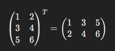

# Темы для подготовки на собеседование на должность фронтенд-разработчика

Содержание:
- [Математика](#математика)  
(пределы, матрицы, простые операции с ними, теория вероятностей)
- [Информатика](#информатика)  
(переводы в системы счисления)
- [Структуры данных](#структуры-данных)  
(определение, принципы работы, применение)
- [Веб](#веб)  
(как работает интернет, протоколы TCP/IP, IP-маршрутизация, DNS, HTML, HTTP/HTTPS, отличия и применение; запросы GET/POST/PUT/DELETE)
- [ООП](#ооп)  
(инкапсуляция, наследование, полиморфизм)
- [Базы данных](#базы-данных)  
(виды, простейшие sql-запросы)
- [Информационная безопасность](#информационная-безопасность)  
(Шифрование, кодирование, хэширование)

## Математика
### Элементы мат.логики
---
**Конъюнкция A ∧ B** - лог. "И"  
**Дизъюнкция A ∨ B** - лог. "ИЛИ"  
**Эквиваленция A ⇔ B**: `true`, если `A = B`  
**Импликация A ⇒ B**: `false`, если `A = true`, `B = false`  
*Реализация импликации в JS:*  
```javascript
!A || B
```  

**Предикат** - суждение, зависящее от переменной. Например: `A(x) = x+2 > 0` - предикат.  
**Квантюры**:  
**∀** – *квантор всеобщности*  
Пример: `∀x: A(x) = true`, если `A(x) = true` для всех `x`.  

**∃** – *квантор существования*  
Пример: `∃x: A(x) = true`, если `A(x) = true` хотя бы для одного `x`. 

### Множества
---
A = {*x* ∈ B | C(*x*)} - множество, состоящее из элементов множества B, обладающими свойством C(x)

X **U** Y - объединение множеств X и Y (все элементы).  
X **⋂** Y - пересечение множеств X и Y (общие элементы).  

X **⊆** Y - X подмножество Y.  
X **⊂** Y - X подмножество Y, но X != Y (строгое подмножество).  

**U** или **Е** - **унивесальное множество**, если каждое данное множество является его подмножеством.  
**Дополнение множества** - это множество недостающих элементов из универсального множества. 

**∅** - пустое множество.  

**Прямым (декартовым) произведением** множеств X и Y называется множество всевозможных упорядоченных пар (x,y).  
Пример: Если X = {1,2,3}, а Y = {5,7}, то X×Y = {(1,5),(1,7),(2,5),(2,7),(3,5),(3,7)}.  

### Некоторые числовые множества:
**ℕ** – множество всех натуральных чисел (1; 2; 3; 4; ...);  
- ℕ0 - с нулём;  
- ℕ1 - без нуля;  

**ℤ** – множество всех целых чисел;  
**ℚ** - множество всех рациональных чисел (-2.56; -5/18; 0; 0.5; 1; 12/7);  
**ℂ** - множество комплексных чисел (a + bi);  
**ℝ** = (−∞, +∞) – множество всех вещественных чисел (числовая прямая);  
**[a,b]** – сегмент (отрезок), т. е. множество всех вещественных чисел `x`, удовлетворяющих неравенству `a <= x <= b`;  
**(a,b)** – интервал, т. е. множество всех вещественных чисел `x`, удовлетворяющих неравенствам `a < x < b`;  
**[a,b), (a,b]** – полуинтервал (полусегмент), т. е. множество всех вещественных чисел `x`, удовлетворяющих соответственно неравенствам `a <= x < b; a < x <= b`;  
**(−∞,a), (a,+∞)** – бесконечные интервалы;  
**(−∞,a], [a,+∞)** – лучи.  

### Предел числовой последовательности
**Предел числовой последовательности** - это число, к которому все члены последовательности приближаются, когда номер члена последовательности становится очень большим. Если предел существует, то говорят, что последовательность сходится к этому пределу.  

Чтобы доказать, что предел последовательности равен определенному числу *L*, вам необходимо строго доказать, что для любого *E* > 0 существует соответствующее натуральное число *N*, начиная с которого все члены последовательности находятся в пределах *E* от *L*.  

Последовательность называется **бесконечно малой**, если предел последовательности при `n -> ∞` равен **0**.  
Последовательность называется **бесконечно большой**, если предел последовательности при `n -> ∞` равен **∞**.  

### Предел функции
---
**Предел функции** - это значение, к которому стремится функция, когда её аргумент приближается к определённому числу. Другими словами, предел функции говорит о том, что происходит с значением функции, когда её аргумент приближается к определённой точке на графике.  

Чтобы **вычислить** предел, иногда можно просто подставить значение, к которому стремится переменная, и вычислить значение функции. Например, `lim x->3 (2x + 1) = 2*3 + 1 = 7`.  
В **сложных ситуациях**, когда нельзя просто подставить значение переменной, существует несколько методов для вычисления пределов функций, например:  
- *Факторизация*: Если функция содержит выражение, которое можно факторизовать или упростить, это может помочь в вычислении предела. Например, `lim x->2 (x^2 - 4) / (x - 2)`. Здесь можно преобразовать числитель к виду `(x - 2)(x + 2)`, и затем сократить `(x - 2)` в числителе и знаменателе, что даст `lim x->2 (x + 2) = 2 + 2 = 4`.  
- *Теорема о пределе композиции функций*: если мы хотим найти предел функции `f(g(x))` при *x*, стремящемся к какому-то числу *c*, мы можем сначала найти предел `g(x)` при *x*, стремящемся к *c*, и затем подставить этот предел вместо `g(x)` в функцию `f(x)` и найти предел этой новой функции.  
Например, если мы хотим найти предел `lim x->0 (sin(x^2))`, мы можем сначала найти предел `lim x->0 (x^2)`, что равно `0^2 = 0`, и затем подставить этот результат в функцию `sin(x)`, получив `sin(0)`, что равно `0`.  

### Матрицы
---
**Матрица** представляет собой упорядоченный набор чисел, расположенных в виде прямоугольной таблицы, состоящей из строк и столбцов. Каждое число в матрице называется **элементом**.  
**Обозначение матрицы**: обычно матрицы обозначаются заглавными буквами, например, **А** или **В**,  а её элементы - маленькими буквами с индексами, например аij, где *i* - номер строки, а *j* - номер столбца.  

### Операции с матрицами
1. **Сложение**: Для сложения матриц они должны быть одинаковых размеров (то есть иметь одинаковое количество строк и столбцов). Сложение происходит покомпонентно, то есть каждый элемент результата равен сумме соответствующих элементов исходных матриц.  
Пример:  
  
2. **Умножение на скаляр**: Умножение каждого элемента матрицы на заданное число.  
Пример:  
  
3. **Умножение матриц**: Умножение матриц определено, когда количество столбцов первой матрицы равно количеству строк второй матрицы. Результатом умножения матриц будет новая матрица, в которой элемент на позиции (*i*, *j*) равен сумме произведений элементов i-й строки первой матрицы на элементы j-го столбца второй матрицы.  
Пример:  
    
4. **Транспонирование**: Транспонирование матрицы означает замену строк матрицы на соответствующие столбцы (и наоборот). Обозначается через A^T.  
Пример:  
  
5. **Определитель матрицы**: Определитель квадратной матрицы *A* размера *n* x *n* обозначается как det(*A*) и является числовой характеристикой этой матрицы. Он используется для решения систем линейных уравнений и определения обратной матрицы. (вычисляется по различным формулам в зависимости от размера и структуры)  
6. **Обратная матрица**: Квадратная матрица *A* имеет обратную, если ее определитель не равен нулю. Обратная матрица *A*^(-1) определяется так, что произведение *A* x *A*^(-1) равно единичной матрице (ед. матр. - квадратная матрица, у которой на главной диагонали стоят единицы, а остальные элементы равны нулю).  
Пример:  
  
7. **Деление матриц**: Умножение на обратную матрицу.  

### Теория Вероятностей  
---
#### Формулы и случаи
Теория вероятностей рассматривает случайные события в рамках бесконечности.  

Виды событий:  
- **Совместимые** — те, которые могут произойти одновременно.
- **Несовместимые** — те, которые исключают друг-друга. Например, при подбрасывании монетки может выпасть либо орёл, либо решка — оба одновременно они выпасть не могут.  

Вероятность события: `[Кол-во благоприятных событий] / [Общее число событий]`.   

**Сумма** событий **A + B**: Если случится событие A **ИЛИ** событие B.  
**Произведение** событий **A x B**: Если случится событие A **И** событие B.  

**Сумма совместимых событий**:  
Если нужно найти вероятность совместимых событий, то необходимо **найти сумму** этих событий и **вычесть** из неё **их произведение**: `A + B - A x B`.  
*Например*, нужно вычислить вероятность того, что выбранное из чисел от 1 до 10 будет *нечётным* ИЛИ *делиться на 7 без остатка*:  
1. Вероятность того, что число нечётное = 0.5;
2. Вероятность того, что число кратно 7 = 0.1;
3. A + B = 0.6;
4. A x B = 0.05;
5. A + B - A x B = 0.6 - 0.05 = 0.55.  

**Сумма несовместимых событий**:  
Если нужно найти вероятность суммы всех несовместимых событий, то необходимо **найти сумму** этих событий и **вычесть** из неё **пересечение** этих событий: `P[A U B] = P[A] + P[B] - P[A ⋂ B]`.  
*Например*, среди учеников школы 15% процентов знают *французский язык* и 20% знают *немецкий*. Доля тех, кто *владеет обоими языками* всего 5%. Необходимо найти долю учеников, знающих *хотя бы один* из этих двух языков:  
- 15% + 20% - 5% = 30%  

**Условная вероятность**:
Если нужно найти вероятность наступления **A при условии B**, нужно **пересечение** обоих вероятностей **разделить на вероятность условия B**: `P[A | B] = P[A ⋂ B] / P[B]`.  
*Например*, среди учеников школы 15% процентов знают *французский язык* и 20% знают *немецкий*. Доля тех, кто *владеет обоими языками* всего 5%. Необходимо среди знающих немецкий найти долю учеников, знающих и французский:  
- 0.05 / 0.20 = 0.25 = 25%  

**Пересечение вероятностей**:  
И обратно, чтобы найти вероятность того, что произойдут оба события A и B, надо умножить вероятность события B на условную вероятность события A при известном B, то есть: `P[A ⋂ B] = P[B] x P[A | B]`.  

---

#### Задачи и примеры  
**Задача 1.** В кармане лежит 6 монет: 2 рублёвых, 2 пятирублёвых и 2 десятирублёвых. Мы по очереди достаём 2 из них случайным образом. Найдите вероятность того, что они обе будут одного номинала.  
**Решение:**  
- Вероятность достать рублёвую монету: 2/6 = 1/3.  
- Вероятность снова достать рублёвую монету: 1/(6-1) = 1/5.  
- Вероятность достать две двухрублёвые монеты = 1/3 x 1/5 = 1/15.  
- Точно такая же вероятность будет для пятирублёвых и десятирублевых монет. Теперь найдем вероятность достать две монеты одного номинала.  
- 1/15 + 1/15 + 1/15 = 3/15 = 1/5 = 0.2

**Задача 2.** Вы бросаете 2 игральные кости с шестью сторонами. Найдите вероятность того, что сумма выпавших очков будет равна 7.  
**Решение:**  
- Общее число возможных результатов при бросании 2 костей равно 6 x 6 = 36.  
- Существует 6 комбинаций, дающих сумму 7.  
- Вероятность события равна 6 / 36 = 1/6.  

**Задача 3.** Бросаем два игральных кубика: красный и синий. Определите вероятность того, что цифры на красном и синем кубиках совпадут.  
**Решение:**  
- Всего существует 6 благоприятных исхода, что цифры совпадут.  
- Всего кобинаций того, упадут два кубика - 36.  
- Вероятность совпадения цифр: 6/36 = 1/6.  

**Задача 4.** В этом же эксперименте с кубиками нужно найти наиболее вероятную сумму цифр на кубиках.  
**Решение:**  
- Мы уже знаем, что всего возможно 36 различных комбинаций результатов бросков двух кубиков.  
- Посмотрим на то, какие суммы могут быть получены при броске двух кубиков:  
Сумма 2: (1, 1)  
Сумма 3: (1, 2), (2, 1)  
Сумма 4: (1, 3), (2, 2), (3, 1)  
Сумма 5: (1, 4), (2, 3), (3, 2), (4, 1)  
Сумма 6: (1, 5), (2, 4), (3, 3), (4, 2), (5, 1)  
Сумма 7: (1, 6), (2, 5), (3, 4), (4, 3), (5, 2), (6, 1)  
Сумма 8: (2, 6), (3, 5), (4, 4), (5, 3), (6, 2)  
Сумма 9: (3, 6), (4, 5), (5, 4), (6, 3)  
Сумма 10: (4, 6), (5, 5), (6, 4)  
Сумма 11: (5, 6), (6, 5)  
Сумма 12: (6, 6)  
- Как видно, наибольшее количество комбинаций (6) существует для суммы 7, значит вероятность выпадения этой суммы больше, чем любой другой (6/36 = 1/6).  

**Задача 5.** Известно, что ученики класса, имеющие двойки по алгебре, составляют 25%, а ученики, имеющие двойки по геометрии, составляют 15%. Сколько учеников имеют двойки и по алгебре, и по геометрии, если ученики, не имеющие двоек ни по одному из предметов, составляют 70%?   
**Решение:**  
- Доля учеников, имеющих двойки хотя бы по одному предмету: 100% - 70% = 30%.  
- Доля учеников, имеющих двойки по обоим предметам одновременно: `P[A ⋂ B] = P[A] + P[B] - P[A U B]`.  
- P[A ⋂ B] = 25% + 15% - 30% = 10%.  

**Задача 6.** В классе 50% мальчиков; среди мальчиков 60% любит мороженое. Какова доля мальчиков, любящих мороженое, среди учеников класса? Как это переформулировать на языке теории вероятностей?  
**Решение:**  
- Доля мальчиков, любящих мороженое: `P[A ⋂ B] = P[B] x P[A | B]`.  
- P[A ⋂ B] = 0.50 x 0.60 = 30%.  

## Информатика  

### Перевод из десятичной системы счисления в любую другую  
Чтобы перевести целое положительное десятичное число в систему счисления с другим основанием, нужно это **число разделить на основание**. Полученное частное **снова разделить на основание**, и дальше до тех пор, пока частное не окажется меньше основания. В результате записать в одну строку последнее частное и все остатки, начиная с последнего.  
Пример 1: Перевести десятичное число 46 в двоичную СС.  
  
Ответ: 101110.  

Пример 2: Перевести десятичное число 934 в шестнадцатеричную СС.  
  
Ответ: 3A6.  

### Перевод из любой системы счисления в десятичную  
Чтобы перевести числа из любой другой системы в десятичную, необходимо получить сумму произведений каждой цифры на степени основания СС, где степени равны от 0 до основания СС в порядке убывания для каждой цифры слева-направо.  
Пример 1: Перевести в десятичную СС восьмеричное число 511.  
  

Пример 2: Перевести в десятичную СС шестнадцаричное число 1151.  
  

## Структуры данных

### Определения
**Структуры данных** (далее **СД**) - это хранилища данных, упорядоченные особым образом и в определенном формате, что позволяет эффективно обрабатывать, хранить, и передавать данные.  
**Контейнер** -  объект, содержащий другие объекты произвольных типа и количества в любом порярке.  
**Коллекция** - объект, содержащий множество других объектов (обычно - однотипных) с возможностью итерации по содержимому.  

### Список наиболее часто используемых СД  
- Массивы (Arrays)
    - Статический массив (Static Array)
    - Динамический массив (Dynamic Array)
    - Одномерный массив (One Dimensional Array)
    - Многомерный массив (Multidimensional Array)  
- Связные списки (Linked Lists)
    - Односвязный список (Singly Linked List)
    - Двусвязный список (Doubly Linked List)  
- Очередь (Queue)
- Стэк (Stack)
- Множество или набор (Set)
- Записи (Records)
- Дерево (Tree)
    - Бинарное (Двоичное) дерево (Binary Tree)
    - Префиксное дерево (Trie)  
- Куча (Heap)
- Граф (Graph)
- Мэп (Map)
- Хэш-мэп (Hash Map)

### Описание и применение  
---
### Массивы (Arrays)
**Описание:** Массивы - это структуры данных, которые позволяют хранить коллекцию элементов одного типа в последовательной памяти. Элементы в массиве доступны по индексу.

**Принцип работы:** Каждый элемент массива имеет уникальный индекс, начиная с 0. Для доступа к элементам массива используется индексация.

**Отличительные особенности:**
- Эффективный доступ к элементам по индексу.

**Применение:** Используются для хранения коллекции элементов одного типа.

**Пример использования**: Хранение списка имен, чисел или других объектов.  

  

---
#### Статический массив (Static Array)
**Описание:** Статический массив - это массив с фиксированным размером, который определяется во время компиляции.

**Принцип работы:** При создании статического массива выделяется фиксированное количество памяти, которое остается постоянным на протяжении всего времени жизни массива.

**Отличительные особенности:**
- Фиксированный размер.
- Ограниченная гибкость при изменении размера.
- Неэффективное добавление или удаление элементов в середине массива.

**Применение:** Используется, когда заранее известно количество элементов и оно не меняется во время выполнения программы.

---
#### Динамический массив (Dynamic Array)
**Описание:** Динамический массив - это массив, размер которого может динамически изменяться во время выполнения программы.

**Принцип работы:** При добавлении элементов в динамический массив, если текущий размер массива недостаточен, выделяется новая область памяти большего размера, и элементы копируются в неё.

**Отличительные особенности:**
- Гибкость изменения размера.
- Эффективное управление памятью.
- Возможность динамического расширения и сжатия.

**Применение:** Используется, когда количество элементов массива неизвестно заранее или может изменяться во время выполнения программы.

---
#### Одномерный массив (One Dimensional Array)
**Описание:** Одномерный массив - это массив, который содержит элементы только в одном измерении.

**Принцип работы:** Элементы в одномерном массиве располагаются в виде последовательной линии.

**Отличительные особенности:**
- Простая структура.
- Удобство доступа к элементам по одному индексу.

**Применение:** Используется для хранения и доступа к данным в одномерной последовательности.

---
#### Многомерный массив (Multidimensional Array)
**Описание:** Многомерный массив - это массив, который содержит элементы в двух или более измерениях.

**Принцип работы:** Элементы в многомерном массиве располагаются в виде таблицы с двумя или более измерениями.

**Отличительные особенности:**
- Более сложная структура, содержащая несколько индексов.
- Позволяет организовать данные в виде таблицы или матрицы.

**Применение:** Используется для хранения и доступа к данным, организованным в виде таблицы, матрицы или других многомерных структур, таких как изображения, таблицы и т. д.

---
#### Доп. информация
- **Векторы** - одномерные динамические массивы.

---
### Связные списки (Linked Lists)
**Описание:** Связные списки - это структуры данных, представляющие собой упорядоченную коллекцию элементов, где каждый элемент может быть связан с предыдущим и/или последующим элементом.

**Принцип работы:** Каждый элемент списка содержит данные и ссылку (указатель) на следующий элемент (или на предыдущий в случае двусвязного списка). Первый элемент списка называется головой, а последний - хвостом.

**Отличительные особенности:**
- Гибкость вставки и удаления элементов.
- Элементы не обязаны располагаться в последовательной области памяти.
- Доступ к элементам может быть неэффективным в сравнении с массивами из-за необходимости проходить по ссылкам.

**Применение:** Используются, когда требуется частое добавление/удаление элементов или когда количество элементов может изменяться.  

  

---
#### Односвязный список (Singly Linked List)
**Описание:** Односвязный список - это список, в котором каждый элемент содержит данные и ссылку (указатель) на следующий элемент в списке.

**Принцип работы:** Первый элемент списка (голова) указывает на второй элемент, второй на третий и так далее, пока последний элемент не указывает на NULL.

**Отличительные особенности:**
- Каждый элемент требует меньше памяти благодаря всего одному указателю.
- Добавление и удаление элементов в начале списка эффективны.
- Доступ к элементу по индексу требует прохода от головы до нужного элемента.

**Применение:** Часто используется, когда требуется частое добавление/удаление элементов в начале списка или когда нет необходимости в произвольном доступе к элементам по индексу.

**Пример использования**: Реализация списка задач или истории браузера.

---
#### Двусвязный список (Doubly Linked List)
**Описание:** Двусвязный список - это список, в котором каждый элемент содержит данные и ссылки (указатели) на предыдущий и следующий элементы в списке.

**Принцип работы:** Каждый элемент списка указывает как на предыдущий, так и на следующий элемент, образуя двунаправленную последовательность элементов.

**Отличительные особенности:**
- Возможность обхода списка как в прямом, так и в обратном направлении.
- Более гибкие операции вставки и удаления элементов, чем у односвязного списка.
- Каждый элемент требует больше памяти из-за двух указателей.

**Применение:** Используется, когда требуется возможность обхода списка как в прямом, так и в обратном направлении, или когда требуется эффективное добавление/удаление элементов как в начале, так и в конце списка.

**Пример использования**: Реализация текстового редактора с возможностью отмены и повторения действий.

---
#### Доп. информация
**Отличия массивов от связных списков:**
1. Упорядоченность элементов:
    - Элементы массива располагаются в памяти последовательно.
    - Элементы списка также упорядочены, но они не обязательно располагаются в памяти последовательно. Вместо этого каждый элемент списка содержит ссылку на следующий (и предыдущий в двусвязном списке) элемент, что позволяет создавать гибкие структуры данных различной длины.
2. Эффективность редактирования:
    - Вставка и удаление элементов в середину массива обычно требует сдвига всех последующих элементов.
    - Вставка и удаление элементов из середины списка обычно более эффективны, поскольку они требуют изменения только ссылок на элементы.

---
### Очередь (Queue)
**Описание:** Очередь - это структура данных, которая работает по принципу FIFO (First-In, First-Out - первым пришел - первым вышел), где элементы добавляются в конец очереди, а извлекаются из начала.

**Принцип работы:** Элементы добавляются (enqueue) в конец очереди, а извлекаются (dequeue) из начала. Это означает, что элементы обрабатываются в порядке их добавления: первым пришел - первым вышел.

**Отличительные особенности:**
- Очередь может быть реализована на основе массива или связанного списка.

**Применение:** Используется в задачах, где требуется управление порядком обработки элементов по принципу FIFO.

**Пример использования:** Обработка задач в очереди, печать документов и т. д.  

  

---
### Стэк (Stack)
**Описание:** Стэк - это структура данных, которая работает по принципу LIFO (Last-In, First-Out - пришел последним - первым вышел), где последний добавленный элемент будет первым извлеченным.

**Принцип работы:** Элементы добавляются (push) и извлекаются (pop) только с одного конца стека, который называется вершиной.

**Отличительные особенности:**
- Стек может быть реализован на основе массива или связанного списка.

**Применение:** Используется в задачах, где необходимо сохранять порядок выполнения операций.

**Пример использования:** Рекурсивные вызовы функций, обратный обход деревьев и т. д.  

  

---
### Множество или набор (Set)
**Описание:** Множество или набор - это структура данных, представляющая собой коллекцию уникальных элементов без упорядочения.

**Принцип работы:** Множество содержит только уникальные элементы, и оно предоставляет операции для добавления, удаления и проверки наличия элемента.

**Отличительные особенности:**
- Каждый элемент в множестве уникален.
- Множество может быть реализовано на основе хеш-таблицы, бинарного дерева поиска и т. д.

**Применение:** Используется в случаях, когда необходимо хранить уникальные элементы и выполнять операции добавления, удаления и поиска с высокой эффективностью.

**Пример использования:** Поисковые алгоритмы, проверка уникальности данных и т. д.

---
### Записи (Records)
**Описание:** Записи - это структура данных, которая позволяет объединить несколько связанных данных в один объект.

**Принцип работы:** Каждая запись содержит набор полей (атрибутов) для хранения данных, где каждое поле имеет свое имя и тип данных.

**Отличительные особенности:**
- Позволяет организовать данные различных типов в одном объекте.
- Каждое поле может содержать данные различных типов (целые числа, строки, даты и т. д.).
- Предоставляет доступ к данным по имени поля.

**Применение:** Используется для организации структурированных данных.

**Пример использования:** Записи в базах данных, структуры данных для представления объектов и т. д.

---
### Дерево (Tree)
**Описание:** Дерево - это иерархическая структура данных, состоящая из узлов, соединенных рёбрами, где каждый узел имеет родителя и ноль или более дочерних узлов.

**Принцип работы:** Дерево состоит из корня (вершины) и набора поддеревьев, каждое из которых является деревом по отношению к своему корню. Узлы в дереве могут иметь различные степени (количество дочерних узлов).

**Отличительные особенности:**
- Каждый узел, кроме корня, имеет ровно одного родителя.
- Наличие иерархической структуры с корнем и поддеревьями.
- Деревья могут быть направленными или ненаправленными.

**Применение:** Используются в различных областях информатики, таких как структуры данных, алгоритмы поиска, организация файловой системы и т. д.

**Пример использования:** Представление структуры файловой системы или иерархии категорий товаров в интернет-магазине.

---
### Бинарное (Двоичное) дерево (Binary Tree)
**Описание:** Бинарное дерево - это дерево, в котором каждый узел имеет не более двух дочерних узлов: левого и правого.

**Принцип работы:** Каждый узел бинарного дерева имеет указатели на левого и правого потомка (или NULL, если потомок отсутствует). Узлы могут содержать как данные, так и ключи.

**Отличительные особенности:**
- Простая структура, которая обеспечивает эффективные операции вставки, удаления и поиска.

**Применение:** Используются в различных алгоритмах, таких как поиск, сортировка, и т. д.

#### Бинарное дерево поиска (Binary Search Tree)
**Бинарное дерево поиска** — это бинарное дерево, обладающее дополнительными свойствами: значение левого потомка меньше значения родителя, а значение правого потомка больше значения родителя для каждого узла дерева. То есть, данные в бинарном дереве поиска хранятся в отсортированном виде. 
При каждой операции вставки нового или удаления существующего узла отсортированный порядок дерева сохраняется. При поиске элемента сравнивается искомое значение с корнем. Если искомое больше корня, то поиск продолжается в правом потомке корня, если меньше, то в левом, если равно, то значение найдено и поиск прекращается.  

  

---
### Префиксное дерево (Trie)
**Описание:** Префиксное дерево, также известное как trie (произносится "трай"), - это структура данных, используемая для хранения ассоциативного массива, где ключи представляют собой строки.

**Принцип работы:** Каждый узел префиксного дерева представляет собой символ строки, и путь от корня до узла образует ключ. Листья могут содержать дополнительные данные или указывать на них.

**Отличительные особенности:**
- Эффективное хранение и поиск строковых ключей.
- Оптимизирован для операций префиксного поиска (например, поиск всех слов, начинающихся с определенного префикса).

**Применение:** Префиксные деревья широко используются в компьютерных сетях, поисковых системах, словарях и других задачах обработки текста.

**Пример использования:** Реализация поиска по словарю или автодополнения в текстовых редакторах.  

  

---
### Куча (Heap)
**Описание:** Куча - это структура данных, которая представляет собой специальный вид дерева, где каждый узел удовлетворяет условию кучи (например, для кучи максимума, каждый узел больше или равен своим дочерним узлам).

**Принцип работы:** Кучи часто используются для реализации приоритетных очередей, где наибольший (или наименьший) элемент всегда находится в корне дерева.

**Отличительные особенности:**
- Кучи могут быть максимальными (max heap), где наибольший элемент находится в корне, или минимальными (min heap), где наименьший элемент в корне.

**Применение:** Кучи используются в различных алгоритмах, таких как сортировка кучей (Heap Sort), приоритетные очереди (Priority Queues) и реализация алгоритмов поиска максимального или минимального элемента.  

  

---
### Граф (Graph)
**Описание:** Граф - это абстрактная структура данных, которая представляет собой набор вершин (узлов), соединенных рёбрами (дугами).

**Принцип работы:** Граф состоит из набора вершин и набора рёбер, которые связывают эти вершины. Рёбра могут быть направленными или ненаправленными.

**Отличительные особенности:**
- Может быть направленным (рёбра имеют направление) или ненаправленным (рёбра не имеют направления).
- Позволяет представлять различные виды отношений между объектами.
- Может содержать циклы (циклические графы) или не содержать (ациклические графы).

**Применение:** Графы используются для моделирования различных ситуаций, таких как социальные сети, транспортные сети, сети компьютеров, математические задачи, маршрутизация в сетях и т. д.  

  

---
### Мэп (Map)
**Описание:** Мэп, также известный как словарь или ассоциативный массив, - это структура данных, которая хранит ключи и связанные с ними значения в виде пар (ключ, значение). Каждый ключ в мэпе уникален, и он связан с определенным значением.

**Принцип работы:** Мэп предоставляет операции для добавления, удаления и поиска значения по ключу. Ключи обычно должны быть уникальными в мэпе.

**Отличительные особенности:**
- Уникальные ключи: Каждый ключ в мэпе должен быть уникальным.
- Динамическое расширение: Многие реализации мэпа автоматически расширяются при необходимости, чтобы вместить больше элементов.
- Гибкость в типах данных: Многие мэпы позволяют использовать любые типы данных для ключей и значений.

**Применение:** Используется для хранения пар ключ-значение, когда требуется быстрый доступ к данным по ключу, например, в качестве кэша, баз данных, реестров и т. д.  

  

---
### Хэш-мэп (Hash Map)
**Описание:** Хэш-мэп - это структура данных, предназначенная для хранения пар ключ-значение, где каждый ключ уникален. Принцип его работы основан на использовании хэш-функции для преобразования ключа в индекс массива, где будет храниться соответствующее значение.

**Принцип работы:** Хэш-мэп использует хэш-функцию для преобразования ключа в индекс массива, где хранится связанное значение. Хэш-фукнкция применяется также для поиска значения по ключу, удаления или обновления элемента.

**Отличительные особенности:**
- Быстрый доступ к данным.
- В случае коллизии (когда два ключа хэшируются в один индекс), используется метод разрешения коллизий.

**Применение:** Хэш-мэпы широко используются в различных языках программирования для реализации ассоциативных массивов, хранения кэша, работы с базами данных, обработки данных и т. д.  

  

## Веб

## ToDo  

### Веб 

## Полезные ссылки
[Основы веба, которые должен знать начинающий разработчик](https://habr.com/ru/companies/ruvds/articles/720704/)  
[Типы HTTP-запросов и философия REST](https://habr.com/ru/articles/50147/)  
[Архитектура веба: основы для начинающих разработчиков](https://tproger.ru/translations/web-architecture-101/)  
[Сети](https://github.com/dmryutov/web-developer-cheatsheet/blob/master/General/%D0%A1%D0%B5%D1%82%D0%B8.md)  

